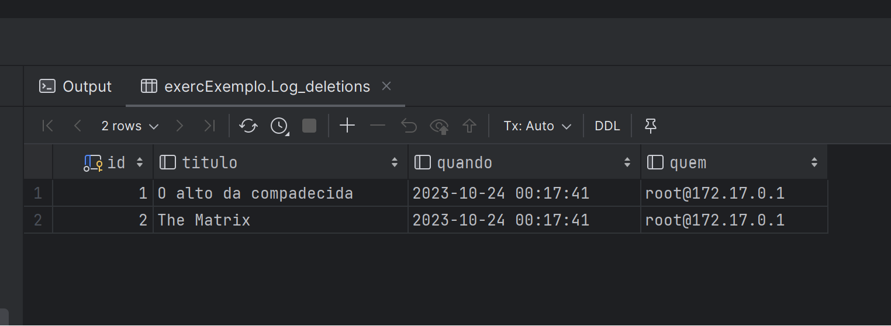

# exercExemplos3010

#Exemplo 1

## Script Primeiro Exemplo:
[Scritps](scriptExemplo1.sql)

## Execução dos scripts para Exemplo 1:

Nesta execução, após inserirmos um novo cliente apenas com o nome do cliente, o trigger foi acionado e já adicionou a data do pedido 'automaticamente'.

#Exemplo 2

##Script Segundo Exemplo:
[Scritps2](scriptExemplo2.sql)

## Exemplo 2, execução do select Log_deletions:

Neste select, que foi realizado após inserirmos os dados, e após o delete, foi executada a Log_deletions, que enviou os dados da deleção para a tabela Log_deletions, e retornou exatamentos os dados configurados.

## Exemplo 2, execução do select na tabela Filmes:

Nesta execução selecionamos tudo que está dentro da tabela Filmes, que nos retornou os registros, com o valor null para minutos onde o valor que seria inserido foi menor que 0, executando assim a trigger chk_minutos, que verifica se o que foi inserido em minutos é menor que 0 e se for, gera um erro.

